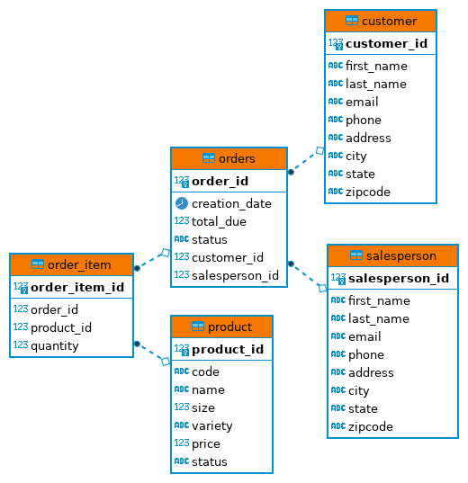

# Introduction
In this program, I have created a simple 'Customer Order Processing System' which includes 'Customer', 'Order' and 'Salesperson' as main entities. In this program, I have used JDBC to access data from RDBMS.
The advantage of JDBC is that an application created using JDBC can access a variety of relational databases and run on any platform with a Java Virtual Machine. Following this application, you can add, delete, update and display a Customer from the database.
The main purpose is to practice read, write, update, and delete (CURD) data against an RDBMS database implementing Data Access Object (DAO) and Data Transfer Object (DTO) Design Patter.

This program was created using the following Technologies and Application Development concepts:
 - JDBC
 - Postgres SQL
 - PSQL Client Tool
 - Maven
 - Docker to create psql container
 - IntelliJ and DBeaver
 
# Implementaiton
## ER Diagram
Following is the Entity Relationship Diagram.

## Design Patterns
**DAO Pattern - Data Access Object** DAO is one of the most common design patterns while dealing with databases. DAO provides an abstraction layer between the JDBC code and the rest of the code in your application. You can use DAO with DTO as a pure abstraction layer. The benefit is that it hides complexity in your JDBC code and separates it from the rest of the code providing a much better implementation.

Following are the participants in Data Access Object Pattern.

- **Data Access Object Interface** This interface defines the standard operations to be performed on a model object(s) like CURD operations in our case (same as util/DataAccessObject.java).
- **Data Access Object concrete class** This class implements the above interface. This class is responsible to perform CURD operations getting data from a data source which can be a database or any other storage mechanism. In our case CustomerDAO.
- **Model Object** This is a simple class containing getter and setter methods to store data retrieved using DAO class e.g. Customer.

**Repository Pattern** In this Design Pattern a repository layer is added between the domain and data mapping layers to isolate domain objects from details of the database access code and to minimize scattering and duplication of query code. The Repository pattern is especially useful in systems where number of domain classes is large or heavy querying is utilized.

# Test
 - Manual testing executing test cases for database connectivity and each CURD operation.
    - Testing database connectivity and displaying a proper message
    - Testing each CURD operation and verifying results from the database manually.
 - Using logger to debug the program and see if what response is getting back from the database. It is best to test statement execution using logger because, in some scenarios like the DELETE clause, it does not give an error if the deleting record does not exist. But it does return the number of records that are deleted. In this way, you can verify it by checking the return value of executing statement. I prefer this approach for the rest of the clauses as well.