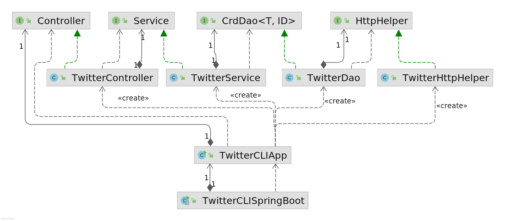

# Introduction

This is a Twitter CRUD application that allows users to post, read and delete a Tweet from the command line using the official Twitter REST API. The app connects to a Twitter REST API using java libraries, OAuthConsumer and HttpClient. This application is based on MVC and DAO design patterns. Following technologies were used while creating this application:
- Twitter REST API
- Maven
- JDBC
- HTTP Client
- JSON
- JUnit and Mockito
- Springboot
- Docker

# Quick Start

## Twitter Developers Account
To run this application, first, you need to set up your Twitter Developers Account https://developer.twitter.com/en and save the keys (Consumer Keys, Access Token, and Secret) to connect to Twitter Rest API.

## 1) Maven
To run the program using Maven, execute the following commands. For more information on how to use this app, please refer to the Docker section.
```shell
mvn clean package -Dmaven.test.skip=true
java -DconsumerKey=YOUR_VALUE \
-DconsumerSecret=YOUR_VALUE \
-DaccessToken=YOUR_VALUE \
-DaccessSecret=YOUR_VALUE \
-jar target/java_apps-1.0-SNAPSHOT.jar post|show|delete [options]
```
## 2) Docker
```shell
#pull docker image from Docker Hub
#it pulls the latest image
docker pull ayeshahamad/twitter_app

#verify if docker image is pulled
docker image ls | grep "ayeshahamad/twitter_app"
```
## Twitter CURD 
Once you have downloaded the Docker image, run the following commands to perform the Twitter CRUD operation.

### Post a Tweet
- USAGE: TwitterApp post [tweet_text] [latitude:longitude]
```shell
#running docker container with Twitter image
docker run --rm \ 
-e consumerKey=YOUR_VALUE \ 
-e consumerSecret=YOUR_VALUE \ 
-e accessToken=YOUR_VALUE \ 
-e accessSecret=YOUR_VALUE \ 
ayeshahamad/twitter_app "post" "tweet_text" "latitude:longitude"
```
### Read a Tweet
- USAGE: TwitterApp show [tweet_id] [field1,fields2]
- Fields are optional
````bash
docker run --rm \ 
-e consumerKey=YOUR_VALUE \ 
-e consumerSecret=YOUR_VALUE \ 
-e accessToken=YOUR_VALUE \ 
-e accessSecret=YOUR_VALUE \ 
ayeshahamad/twitter_app "show" "tweet_id" "field1,fields2"
````
### Delate a Tweet
- USAGE: TwitterApp delete [tweet_id1,tweet_id2,..]
- You can delete single/multiple tweets by passing tweet id(s)
```shell
docker run --rm \ 
-e consumerKey=YOUR_VALUE \ 
-e consumerSecret=YOUR_VALUE \ 
-e accessToken=YOUR_VALUE \ 
-e accessSecret=YOUR_VALUE \ 
ayeshahamad/twitter_app "delete" "tweet_id1,tweet_id2"
```
# Design
## UML diagram


- `TwitterCLIApp` This class takes the command line arguments and sends them to the Controller, calling specific methods (post, read, delete), and displays the response obtained by the Controller. Throws exception for invalid app usage.


- `TwitterController` This layer is responsible for parsing the command line arguments, creating a tweet object, and sending it to the Service layer. It throws exceptions for the invalid number of arguments. 


- `TwitterService` The service layer is responsible for handling the business logic and throws an exception if it is not being followed. In the case of Post Tweet, it checks if tweet text length is less than 140 characters and valid geographical location is added. For 'Show/Delete' it validates tweet ID. Also validates the fields entered by the user and sends the validated data to the TwitterDAO layer and returns the response object to the controller.


- `TwitterDAO` This layer is responsible for creating URI and invoking the relevant GET and POST methods for HttpHelper. It also parses the response returned by HttpHelper, checks if it is valid and deserializes the JSON string to the tweet object, and returns the object to the Service layer.


- `HttpHelper` This class is responsible for creating and authenticating the connection using OAuth1 and Application keys and tokens. It also implements two methods for sending POST and GET requests required for Twitter REST API.

## Models
Implemented the following classes to represent a simplified version of the Tweet Model.

- **Tweet** is the simplified version of the Twitter Tweet model. Only fields we want to use are added to create a JSON.
- **Entities** contains a list of hashtags and user mentions.
- **HashTag** shows the hashtag text added to the tweet while posting.
- **UserMention** shows the users that have been mentioned in a tweet while posting.
- **Coordinates** represents the location of the user as latitude and longitude. And are added while posting the tweet.

## Spring
- **TwitteCLIApp:** At first, TwitteCLIApp class was created to start the app. In this class, we initiated and added all dependencies manually. However, this approach can only be used in the case of a few dependencies. If you have several Controllers and Service layers in that case Spring framework are very handy. It eliminates a lot of manual work and solves the Dependency management(DM) problem.


- **TwitterCLIBean:** To implement TwitterCLIBean, first added @Configuration to the class to mark that this is Spring Config file. Then defined dependency relationship using @Bean and pass dependency through method arguments. Then an IoC container is created to automatically initiate all Beans based on the relationships specified in the config file. We only need to set the entry point here, TwitterCLIApp, and run the application.


- **TwitterCLIComponentScan:** TwitterCLIComponentScan is implemented to reduce further manual work of creating Beans. First, we specify @Controller, @Service, @Components, and @Repository and add @Autowired annotation to constructors to tell the IoC container to inject dependencies. Then, we also need to specify @Configuration and @ComponentScan annotations to mark the config file and look for beans in the base package. At last, create an IoC container and specify starting component to run the app.


- **TwitterCLISpringBoot:** TwitterCLISpringBoot is implemented to configure TwitterCLIApp with SpringBoot. We only have to add @SpringBootApplication annotation. It is a composition of multiple annotations (@Configuration, @EnableAutoConfiguration, and @ScanComponent) and helps configure Spring automatically. This class implements CommandLineRunner and overrides the method run. You only specify the starting point that is TwitterCLIApp, and in the overridden method 'run' runs the app.

# Test
This program was developed using a bottom-up approach. As each layer (DAO, Service, Controller) was created, fully automated integration testing was performed, using JUnit Testing to see if each module was working fine.

## Deployment
For deployment, this program has been dockerized as follows so that you can access it easily.

```shell
#Register Docker hub account
docker_user=docker_hub_id

#It creates connection with docker hub and prompts to enter username and password
docker login 

#Creating a dockerfile
cat > Dockerfile << EOF
FROM openjdk:8-alpine
COPY target/java_apps*.jar /usr/local/app/twitter/lib/twitter.jar
ENTRYPOINT ["java","-jar","/usr/local/app/twitter/lib/twitter.jar"]
EOF

#Pakcaging java twitter app
mvn clean package

#building a new docker image locally
docker build -t ${docker_user}/twitter_app .

#verifying docker image locally
docker image ls | grep "twitter_app"

#pushing image to Docker Hub
docker push ${docker_user}/twitter_app
```

# Improvements
- Making the output in a more readable form for the user. Although it is an intended JSON string.
- Ability to read multiple tweets.
- Ability to search tweets containing specific tags (search pattern) other than tweet id.