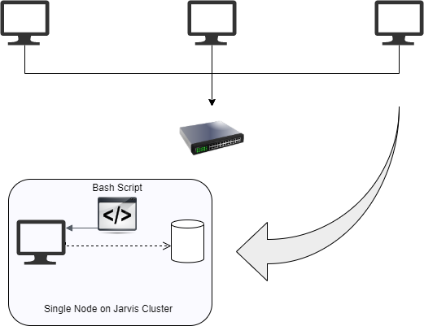
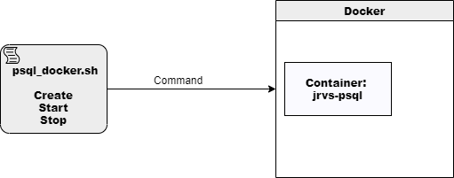
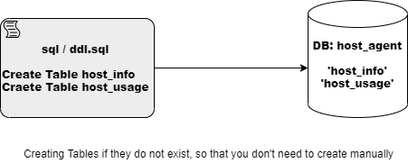
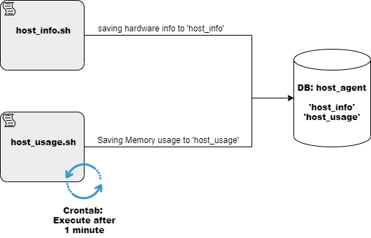
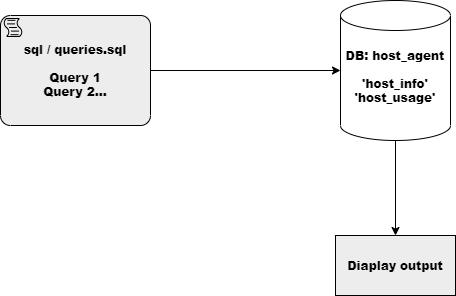

# Linux Cluster Monitoring Agent
# Introduction
This project is designed to manage and administer Jarvis Linux Cluster, so that the LCA team can get hardware specifications and software utilization, memory/CPU management and generate reports according to their requirements. This project will help the LCA team to make decisions like if the system is fully utilized or not, or if they want to increase hardware/software specifications.

In this project we have used following technologies.
- docker to create a psql container
- bash scripts
- postgres sql
- git

# Quick Start

- Create/Start/Stop a psql instance using psql_docker.sh
```bash
./scripts/psql_docker.sh create [db_username] [db_password]
./scripts/psql_docker.sh start
./scripts/psql_docker.sh stop
```
- Create tables using ddl.sql
```bash
# Script usage
psql -h HOST_NAME -p PORT -U USER_NAME -d DB_NAME -f FILE_NAME.sql

# Example
psql -h localhost -p 5432 -U postgres -d host_agent -f sql/ddl.sql
```
- Insert hardware specs data into the DB using host_info.sh
```bash
# Script usage
bash scripts/host_info.sh [psql_host] [PORT] [db_name] [psql_user] [psql_password]

# Example
bash scripts/host_info.sh "localhost" 5432 "host_agent" "postgres" "password"
```
- Insert hardware usage data into the DB using host_usage.sh
````bash
# Script usage
bash scripts/host_usage.sh [psql_host] [PORT] [db_name] [psql_user] [psql_password]

# Example
bash scripts/host_usage.sh "localhost" 5432 "host_agent" "postgres" "password"
````
- Crontab setup
````bash
#edit crontab jobs
bash> crontab -e

#add this to crontab to execute every minute
* * * * * bash /copy_complete_path_to_script/host_usage.sh "localhost" 5432 "host_agent" "postgres" "password"

#You can list crontab job(s) that you added
bash> crontab -l
````

# Implemenation
In this project we are implementing MVP, so instead of executing it on Linux Cluster, this program is implemented on a single node of the cluster.
For implementing we have used 
- bash scripts and execution through terminal
- POSTGRES SQL to create database and save results to tables
- installed psql client to execute psql commands and view DB results
- git and GitHub for project backup

## Architecture
Following diagram explain basic architecture of the system.



Following diagrams explains how every single script is executed and what is the purpose.

###Psql_docker.sh


###DDL.sql


###Monitoring Agent


###Queries.sql


## Scripts
Shell script description and usage (use markdown code block for script usage)
- psql_docker.sh
- host_info.sh
- host_usage.sh
- crontab
- queries.sql (describe what business problem you are trying to resolve)

## Database Modeling
Following tables host_info and host_usage are created to save data respectively.


# Test
- Testing scripts for every command 
- Testing if data is saved in database successfully
- Testing if correct data is extracted using bash CLI for host_info and host_usage
- Testing if Tables are created once
- Testing if queries are returning correct results

# Deployment
How did you deploy your app? (e.g. Github, crontab, docker)

# Improvements
Write at least three things you want to improve
- handle hardware update
- 