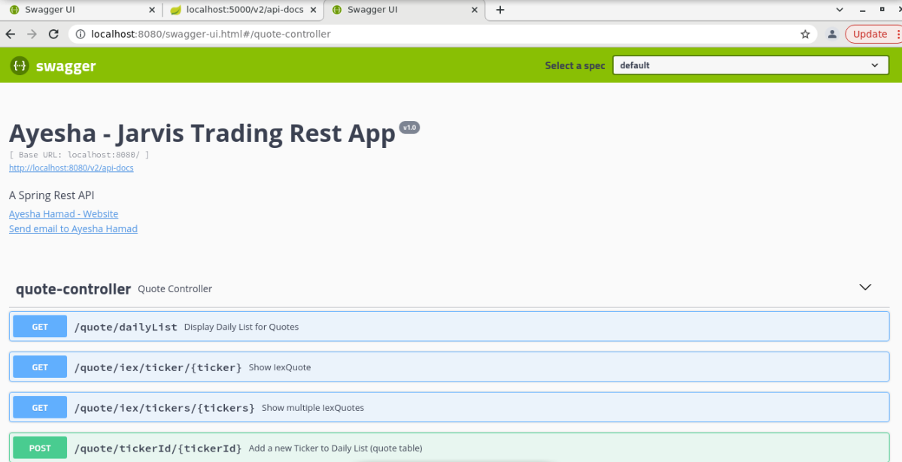

Table of contents
* [Introduction](#Introduction)
* [Quick Start](#Quick Start)
* [Implementation](#Implementation)
* [Test](#Test)
* [Deployment](#Deployment)
* [Improvement](#Improvement)

# Introduction
- Jarvis's trading team wants to develop a new trading platform to replace the legacy system, a monolithic application that is hard to scale and manage. In this project we are developing a new trading system with the microservice architecture and Springboot framework.
- The application allows users to manage client profiles and accounts, monitor portfolio performance, and trade securities.
- Technologies used in this project: Java, Springboot framework, Maven to build and test application, Postgresql, Docker, Swagger, Postman, REST API, MVC  and DAO design patterns. 

# Quick Start
**Prerequisites:** 
- Please verify that you have installed Docker version higher than 17.
- It is recommended to use CentOS 7, Linux VM for compatibility.
- Make sure you get and save IEX Token from here, it will be used later in the app.

Using terminal execute following commands to pull docker images.
````shell
#download images from docker hub
docker pull ayeshahamad/trading-psql
docker pull ayeshahamad/trading-app
````
Create a docker network. We need to make a Docker network to link our containers.
```shell
#create a new docker network
sudo docker network create trading-net-springboot

#verify if network is created
docker network ls
```
Start docker psql container by using downloaded image: ayeshahamad/trading-psql
```shell
docker run --name trading-psql-dev \
-e POSTGRES_PASSWORD=password \
-e POSTGRES_DB=jrvstrading \
-e POSTGRES_USER=postgres \
--network trading-net-springboot \
-d -p 5432:5432 ayeshahamad/trading-psql
```
Start docker trading app container by using downloaded image: ayeshahamad/trading-app
```shell
#add IEX_TOKEN
IEX_TOKEN=YOUR_TOKEN
docker run --name trading-app-dev \
-e "PSQL_URL=jdbc:postgresql://trading-psql-dev:5432/jrvstrading" \
-e "PSQL_USER=postgres" \
-e "PSQL_PASSWORD=password" \
-e "PSQL_HOST=trading-psql-dev" \
-e "PSQL_PORT=5432" \
-e "PSQL_DB=jrvstrading" \
-e "TOKEN=${IEX_TOKEN}" \
--network trading-net-springboot \
-p 8080:8080 -t ayeshahamad/trading-app
```
Once you run the docker containers, you are now able to test the application using swagger with default url: http://localhost:8080/swagger-ui.html



# Implementation
## Architecture
- Draw a component diagram that contains controllers, services, DAOs, SQL, IEX Cloud, WebServlet/Tomcat, HTTP client, and SpringBoot. (you must create your own diagram)
- briefly explain the following components and services (3-5 sentences for each)
    - Controller layer (e.g. handles user requests....)
    - Service layer
    - DAO layer
    - SpringBoot: webservlet/TomCat and IoC
    - PSQL and IEX

## REST API Usage
### Swagger
What's swagger (1-2 sentences, you can copy from swagger docs). Why are we using it or who will benefit from it?
### Quote Controller
- High-level description for this controller. Where is market data coming from (IEX) and how did you cache the quote data (PSQL). Briefly talk about data from within your app
- briefly explain each endpoint
  e.g.
    - GET `/quote/dailyList`: list all securities that are available to trading in this trading system blah..blah..
### Trader Controller
- High-level description for trader controller (e.g. it can manage trader and account information. it can deposit and withdraw fund from a given account)
- briefly explain each endpoint
### App controller
- briefly explain each endpoint

# Test
After adding every Service and Dao component it was tested (integration testing) using JUnit 4 to verify that it is working as expected. Only Controller components were tested directly using Swagger or Postman. The code coverage for all tested components is at least 60%.

# Deployment


## Creating and Executing Dockerfiles
For deployment of this project, we built two docker images using following Dockerfiles:
- Trading app image that uses Maven to build the project and JDK 8 Alpine base image.
```shell
# Dockerfile
# Build stage
FROM maven:3.6-jdk-8-slim AS build
COPY src /build/src
COPY pom.xml /build/
RUN mvn -f /build/pom.xml clean package -DskipTests

# Package stage
FROM openjdk:8-alpine
COPY --from=build /build/target/trading*.jar /usr/local/app/trading/lib/trading_app.jar
ENTRYPOINT ["java","-jar","/usr/local/app/trading/lib/trading_app.jar"]
```
- Build and push docker image to Docker Hub
```shell
#Build image using Dockerfile and verify
docker build -t ayeshahamad/trading-app . 
docker image ls -f reference=ayeshahamad/trading-app

#Push image to Dockerhub
#must have valid Docker Hub credentials
docker push ayeshahamad/trading-app
```
- Psql database image that uses the PostgreSQL base image and initialize the database with tables defined in sql_ddl/schema.sql. So that tables are already created in the psql image.
```shell
#Dockerfile
FROM postgres:9.6-alpine
COPY sql_ddl/schema.sql /docker-entrypoint-initdb.d/

#Build image using Dockerfile and verify
docker build -t ayeshahamad/trading-psql .  
docker image ls -f reference=ayeshahamad/trading-psql

#Push image to Dockerhub
#must have valid Docker Hub credentials
docker push ayeshahamad/trading-psql
```
Now once we have created and uploaded both images on Docker Hub. All you need to do is that follow the [Quick Start](#Quick Start) guide, pull images, create a docker network, create and run docker containers and start the application using swagger or postman.
  
# Improvements
If you have more time, what would you improve?
- Adding a startup script for the users to set up the application. So that it minimizes the manual work for pulling image and creating network etc.
- Transferring funds between accounts.